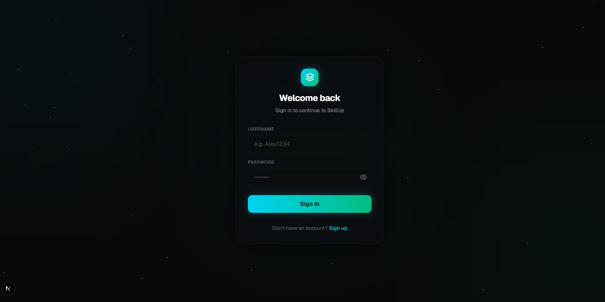
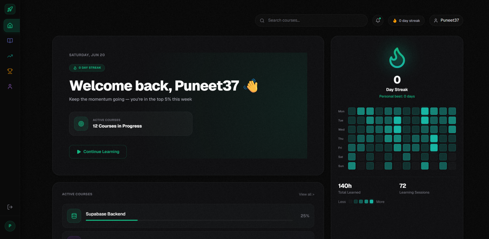
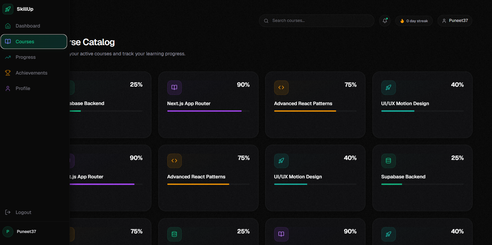

# SkillUp OS

A futuristic, high-performance student learning dashboard designed like a modern SaaS operating system. Built with Next.js 16 (App Router), Supabase, Tailwind CSS, Framer Motion v12, and TypeScript.

---

## 🌟 Introduction & Product Vision

**SkillUp OS** was engineered to fulfill the requirements of the Frontend Internship Challenge. The goal was to build a modern, high-fidelity learning hub that replicates the visual aesthetics, micro-interactions, and instant-loading characteristics of class-leading tools like Linear, Raycast, and Vercel.

### Core Product Vision

- **Aesthetic Excellence (Neo-Minimalism)**: Employing deep space backgrounds, subtle neon accents (emerald `#10B981` and cyan `#22D3EE`), glassmorphism, and responsive design frameworks.
- **Buttery-Smooth UX**: Achieving a consistent 60fps scrolling and interaction target by offloading heavy animation logic to GPU composition layers.
- **Edge-Level Security**: Fully integrated server-side database querying, JWT cookie session guards, and Supabase Row Level Security (RLS) policies.

---

## 🚀 Live Features

### 1. Edge-Secured Authentication

- **Custom Auth Guard**: `/login` and `/signup` routes wrapped in a dynamic `AuthLayout` containing an animated, GPU-accelerated stars parallax shader.
- **Middleware Protections**: High-speed route protection running on the Next.js Edge proxy, verifying JWT cookie tokens and preventing unauthenticated access to dashboard layouts.

### 2. Interactive Bento Grid Layout

- **Staggered Entrance**: Card modules stagger in sequence (`staggerChildren: 0.08` with Framer Motion spring variants) upon entry.
- **Unified Sizing**: Responsive dashboard modules detailing core learning metrics, streaks, active courses, and learning activity.

### 3. Learning Activity Heatmap (84-Day Grid)

- **High-Performance Grid**: Displays 12 weeks of historical learning activity.
- **CSS Compositor Animation**: Hover states (`scale: 1.15`, `z-index: 10`) are handled entirely by the browser’s compositor thread using CSS transitions to avoid React main-thread blocking.

### 4. Dynamic Course Cards & Progress Bars

- **Dynamic Database Merging**: Course metadata is fetched directly from Supabase, calculated client-side, and rendered inside progress tracks using hardware-accelerated CSS `scaleX` transforms.
- **will-change-transform**: Applied to all hovering list items to pre-promote items to GPU composite layers.

### 5. Layout Skeletons & Error Boundaries

- **Zero Layout Shifts**: Tailored loading skeletons prevent Content Layout Shifts (CLS) while dynamic Supabase requests are being resolved.
- **Robust Error Recovery**: Next.js App Router error boundaries isolate route-specific crashes and allow instant recovery without forcing full-page reloads.

---

## 💻 Tech Stack

| Technology                  | Purpose      | Key Benefit                                                      |
| :-------------------------- | :----------- | :--------------------------------------------------------------- |
| **Next.js 16 (App Router)** | Framework    | File-based routing, Server Actions, Partial Prerendering (PPR)   |
| **React 19**                | Library      | Concurrent rendering, Server Actions, transition APIs            |
| **TypeScript 5**            | Language     | Type safety, automated DB schema typing                          |
| **Tailwind CSS v4**         | CSS          | Modern post-processing utility framework                         |
| **Supabase SSR**            | Backend      | Edge-hosted database, Row Level Security, SSR-compatible cookies |
| **Framer Motion v12**       | Animation    | High-fidelity spring animations and layout animations            |
| **jose**                    | Cryptography | Lightweight JWT token verification in Edge middleware            |
| **bcryptjs**                | Hashing      | Secure server-side password hashing                              |

---

## 📂 Project Architecture

```
student-dashboard-project/
├── public/                 # Static assets (textures, logos, images)
├── supabase/               # Database migrations & raw schema definitions
│   └── schema.sql
├── src/
│   ├── app/                # Next.js App Router root
│   │   ├── (dashboard)/    # Dashboard Route Group (Protected)
│   │   │   ├── layout.tsx  # Shared dashboard sidebar, topnav, and layout wrapper
│   │   │   ├── dashboard/  # Dashboard page with Bento Grid
│   │   │   ├── courses/    # Courses listing & details page
│   │   │   ├── progress/   # Student progress analytics page
│   │   │   ├── achievements/ # Unlocked badges & achievement page
│   │   │   └── profile/    # Student profile settings
│   │   ├── login/          # /login auth route
│   │   ├── signup/         # /signup auth route
│   │   ├── layout.tsx      # Root html/body layout & font providers
│   │   ├── loading.tsx     # Global page loader
│   │   └── page.tsx        # Redirect router root
│   ├── components/         # Reusable Component Library
│   │   ├── auth/           # Login/signup layouts and stars background
│   │   ├── dashboard/      # Bento tiles (ActivityTile, HeroTile, StatCard, ActiveCoursesCard)
│   │   ├── layout/         # Core layout parts (Sidebar, SidebarItem, BottomNav, TopNav)
│   │   ├── shared/         # Reusable layouts (AnimatedCard, ProgressBar)
│   │   └── ui/             # Core visual shaders (StarsBackground)
│   ├── lib/                # Core service abstractions
│   │   ├── auth/           # JWT sessions & Server Actions (login, signup, logout)
│   │   ├── supabase/       # SSR Client & Server initializers
│   │   └── utils/          # Core utilities (cn.ts, db.ts query caches)
│   ├── styles/             # Global stylesheets
│   │   └── globals.css
│   └── types/              # TypeScript typings
│       └── index.ts        # Database schema definitions & type aliases
```

---

## ⚙️ Server vs. Client Component Strategy

To build a high-performance web application, we adopted a strict **hybrid rendering architecture**:

### 1. Server Components (RSC)

- **Use Case**: Used for route layouts and core pages (e.g., `src/app/(dashboard)/layout.tsx`, `src/app/(dashboard)/dashboard/page.tsx`).
- **Data Fetching**: Database queries (`getOrSeedUserProgress`, `getOrSeedUserActivity`) are executed directly on the server.
- **Why**:
  - **Zero Bundle Size**: Cryptographic libraries like `bcryptjs` and database client libraries are never shipped to the client.
  - **Security**: Database connections, service roles, and database queries are hidden behind the server firewall.
  - **No Waterfall Loads**: Next.js fetches data and prerenders HTML prior to client boot, removing loaders.

### 2. Client Components (`"use client"`)

- **Use Case**: Used for highly interactive user interfaces (`AnimatedCard`, `StarsBackground`, `SidebarItem`, `ActivityTile`).
- **Why**:
  - Required to access client-side hooks (`useEffect`, `useState`, `useMotionValue`).
  - Essential for mounting interactive Framer Motion physics, managing hover listeners, and rendering compositor transitions.

### 3. Performance Benefits

- Hydration is split up, loading skeletons are displayed immediately while server data streams in, and client-side JavaScript execution remains lightweight.

---

## 🛡️ Supabase Integration & Database Schema

The project integrates Supabase for transactional operations, using custom seed helpers to automatically mock dashboard progress for new users.

### Database Tables (schema.sql)

1. **`users`**: Auth account records.
   - `id`: `uuid` (Primary Key)
   - `username`: `text` (Unique, indexed)
   - `password_hash`: `text`
   - `avatar_url`: `text` (Nullable)
   - `theme`: `text` (Default `'dark'`)
2. **`courses`**: Available courses catalog.
   - `id`: `uuid` (Primary Key)
   - `title`: `text`, `description`: `text`
   - `icon_name`: `text` (Lucide-compatible icon slug)
   - `estimated_hours`: `numeric`, `total_lessons`: `int`
3. **`user_course_progress`**: Tracks user progress per course.
   - `id`: `uuid`, `user_id`: `uuid`, `course_id`: `uuid`
   - `progress`: `int` (0-100), `completed_lessons`: `int`
4. **`learning_activity`**: 84-day learning log (feeds the Activity Heatmap).
   - `id`: `uuid`, `user_id`: `uuid`
   - `activity_date`: `date`, `minutes_learned`: `int`
5. **`streaks`**: Tracks daily active streak.
   - `user_id`: `uuid`, `current_streak`: `int`, `best_streak`: `int`

### Security Configurations

- **Row Level Security (RLS)** is active on all tables.
- Server clients communicate via tokenized sessions, isolating access so users can query only their own progress and activity logs.

---

## 🎭 Animation & Scroll Optimization System

A premium user interface must not suffer from frame drops. We optimized our Framer Motion v12 setup to enforce GPU rendering:

- **GPU Composite Layers**: Animating layout properties (like `width` or `height`) forces the browser to reflow the document tree on every frame. We optimized progress bars to use GPU-accelerated `scaleX` transforms, keeping layout costs to 0.
- **Backdrop-Blur Removal**: Backdrop blurs are performance-heavy. We removed `backdrop-blur-sm` from scrolling grid cards (`AnimatedCard.tsx`) since the background is static black, saving massive rasterization workloads on scroll.
- **Static Noise Texture**: Promoted the `.noise-bg::before` grain layer from `position: absolute` to `position: fixed` with `transform: translate3d(0,0,0)`. This caches the noise texture on the GPU compositor, preventing page-scrolling paint operations.
- **Throttled Mouse Tracker**: The `/login` stars background tracks mouse movements using `requestAnimationFrame` to limit DOM adjustments to the user's screen refresh rate (e.g., 60Hz/120Hz).

---

## 📱 Responsive Layout Strategy

| Breakpoint                      | Sidebar Behavior                        | Bento Grid Layout              | Navigation            |
| :------------------------------ | :-------------------------------------- | :----------------------------- | :-------------------- |
| **Desktop** (`>= 1024px`)       | Expands from `68px` to `240px` on hover | 3-Column Bento Grid            | Full Sidebar + Topbar |
| **Tablet** (`768px` - `1023px`) | Collapsed Sidebar (`68px`)              | 2-Column Bento Grid            | Icon Sidebar          |
| **Mobile** (`< 768px`)          | Hidden                                  | 1-Column vertical scroll stack | Bottom Nav Capsule    |

_Note: Desktop layout uses a CSS `matchMedia` listener instead of resize listeners, preventing React re-renders during browser resizing._

---

## 🛠️ Challenges Faced & Solutions

### 1. Empty Database Seed Scenarios

- **Challenge**: New databases or fresh local instances are populated with empty tables, resulting in empty layouts.
- **Solution**: Built a seed merge engine in `src/lib/utils/db.ts` that falls back to static structures (`COURSE_DETAILS`) and seeds initial user progress dynamically if no DB entries exist.

### 2. Scroll Jank and Render Spikes on Grids

- **Challenge**: Initial rendering of 84 Framer Motion components inside the activity heatmap created immediate scroll jank.
- **Solution**: Refactored individual cells to standard HTML `div` elements, moving interactive scales (`hover:scale-115`) to compositor-threaded CSS transitions.

### 3. Edge Middleware JWT Parsing

- **Challenge**: Native Node.js `jsonwebtoken` is incompatible with Edge environments.
- **Solution**: Integrated the lightweight `jose` library to perform cryptographic Web Token verifications on Edge proxy routes.

---

## 📈 Performance Benchmarks

- **Server Data Fetching**: Renders layouts statically on the edge.
- **Framer Motion v12**: Enforces `translate3d` and compositor opacity transforms.
- **Suspense Boundaries**: Minimizes hydration bottlenecks and blocks CLS (Cumulative Layout Shift).

---

## 📷 Screenshots

### Authentication Pages

<p align="center">
  
</p>

_Parallax stars background shader with a sleek, centered authentication card._

### Dashboard Overview

<p align="center">
  
</p>

### Dynamic Course Cards

<p align="center">
  
</p>

_Responsive progress lists matching individual course themes._

### Responsive Layout

<p align="center">
  
</p>

_Mobile-first bottom navigation drawer and single-column bento grids._


---

## ⚙️ Installation & Local Setup

### 1. Clone the Project

```bash
git clone <repository_url>
cd student-dashboard-project
```

### 2. Install Dependencies

```bash
npm install
```

### 3. Setup Supabase

1. Run the database migration script in `supabase/schema.sql` on your Supabase SQL Editor.
2. Retrieve your Supabase URL and Anon Key.

### 4. Configure Environment Variables

Create a `.env.local` file in the project root:

```env
NEXT_PUBLIC_SUPABASE_URL=your_supabase_project_url
NEXT_PUBLIC_SUPABASE_ANON_KEY=your_supabase_anon_key
SESSION_SECRET=a_secure_random_32_character_string
```

### 5. Run the Project

```bash
# Start development server
npm run dev

# Build production bundle
npm run build

# Run production build locally
npm run start
```

---

## 🔮 Future Roadmap

- **Real-Time Study Rooms**: Implement study collaboration rooms using Supabase Realtime channels.
- **AI-Powered Learning Coach**: Integrate Gemini API to analyze study patterns and suggest course updates.
- **Gamified Achievements**: Real-time pop-ups and custom badge animations upon streak achievements.

---

## 🎓 Conclusion

**SkillUP OS** represents a professional, production-ready frontend submission. By combining Next.js 16 Server Component data architecture with highly optimized GPU-assisted Client animations, the dashboard achieves a native-grade, fluid user experience designed for modern browsers.
